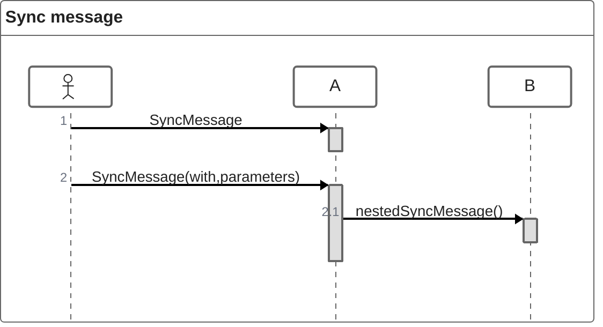
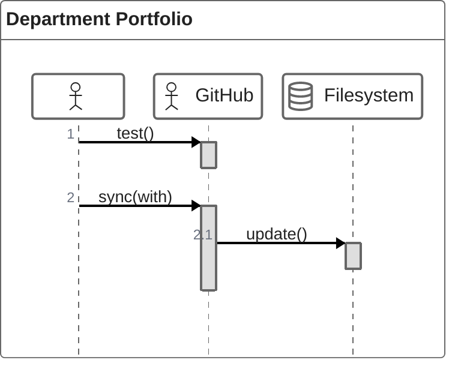

```mermaid
zenuml
    title Sync message
    A.SyncMessage
    A.SyncMessage(with, parameters) {
      B.nestedSyncMessage()
    }
```

```mermaid
zenuml
    title Department Portfolio
    @Actor GitHub
    @Database Filesystem
    GitHub.test()
    GitHub.sync(with){
        Filesystem.update()
    }

```

